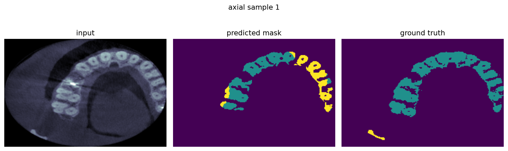
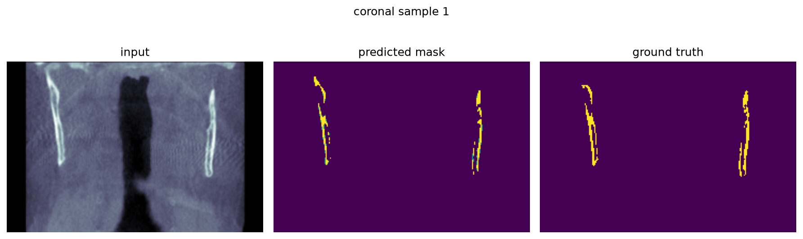
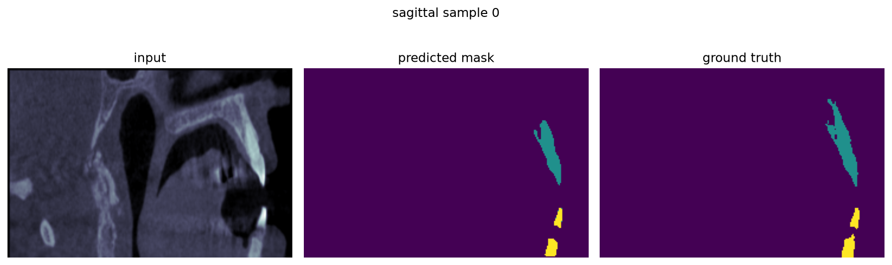

# Jaws Segmentation

U-Net segmentation of the upper jaw (maxilla) and lower jaw (mandible) from DICOM CT slices. A separate 3-class model (background / maxilla / mandible) is trained per anatomical plane — axial, coronal, sagittal — since the dataset provides 2D slices along all three orthogonal views rather than a full 3D volume.

[](https://github.com/AliMahere/jaws_segmentation/actions/workflows/ci.yml)


## Demo

Real predictions from the shipped checkpoints on real held-out test slices (not synthetic, not cherry-picked results — the raw model output, warts and all):

| Axial | Coronal | Sagittal |
|---|---|---|
|  |  |  |

## Results

Dice score on the real test split, per plane, computed by `jaws-evaluate` against the checkpoints in `checkpoints/` (background excluded from the mean — it dominates every slice and would otherwise mask how well the model actually finds jaw tissue):

| Plane | Test slices | Maxilla Dice | Mandible Dice | Mean Dice (fg) | Eval time (GTX 1660 Ti) |
|---|---|---|---|---|---|
| Axial | 1,450 | 0.321 | 0.451 | **0.386** | ~38s |
| Coronal | 2,348 | 0.606 | 0.762 | **0.684** | ~117s |
| Sagittal | 2,448 | 0.640 | 0.712 | **0.676** | ~93s |

Axial trails coronal/sagittal by a wide margin — the original notebook's own axial-download lines were left commented out, so axial evidently got less training attention than the other two planes. Full per-run output: [`results/axial.json`](results/axial.json), [`results/coronal.json`](results/coronal.json), [`results/sagittal.json`](results/sagittal.json).

## Problem & dataset

The dataset provides 2D CT slices along three orthogonal planes, each paired with a 3-class label mask (background / maxilla / mandible), split into per-plane train/test sets. Dataset provenance is limited — no public documentation was found for it beyond the S3 bucket it ships from, and the case-level metadata needed for true 3D reconstruction isn't available. Each plane is treated as an independent 2D segmentation problem; there is no cross-plane fusion or 3D volume reconstruction.

## Architecture

- **Model**: standard U-Net, 5-level encoder/decoder (64→128→256→512→1024 channels) with skip connections. Upsampling is transposed convolution (`bilinear=False`) — this is how the shipped checkpoints were trained, and eval/predict code hard-defaults to it for checkpoint compatibility.
- **Loss**: `CrossEntropyLoss` + multiclass soft Dice loss.
- **Optimizer**: RMSprop with `ReduceLROnPlateau` (maximizing validation Dice).
- **Augmentation** (train split only): random rotation (±35°, p=0.7) and horizontal flip (p=0.6), applied identically to image and mask via a single shared random draw per sample.

## Project structure

```
src/jaws_seg/
├── models/          U-Net (unet_model.py, unet_parts.py)
├── data/            dataset loading (dataset.py) + optional dataset download (download.py)
├── config.py         dataclass configs + seeding
├── cli_common.py     shared CLI args, checkpoint resolution
├── metrics.py        dice_coeff, multiclass_dice_coeff
├── losses.py          dice_loss
├── engine.py           shared evaluate() / evaluate_detailed()
├── viz.py               prediction plotting
├── train.py / evaluate.py / predict.py   CLI entry points
tests/                 synthetic-data, CPU-only test suite
legacy/                original 2022 notebook + unet/ package, preserved as-is
notebooks/             thin demo notebook that imports from jaws_seg
docs/assets/           curated result images used in this README
```

## Getting started

```bash
python -m venv .venv
.venv\Scripts\activate            # Windows; use `source .venv/bin/activate` on Linux/macOS

# GPU (CUDA 12.4):
pip install torch==2.6.0 torchvision==0.21.0 --index-url https://download.pytorch.org/whl/cu124
# CPU-only:
pip install torch==2.6.0 torchvision==0.21.0 --index-url https://download.pytorch.org/whl/cpu

pip install -e ".[dev]"
```

Point the package at your dataset. If you already have `dataset/<plane>/{train,test}` somewhere else on disk, link it in rather than copying ~5.6GB:

```powershell
# Windows (no admin required):
New-Item -ItemType Junction -Path .\dataset -Target "C:\path\to\dataset"
```

```bash
# Linux/macOS:
ln -s /path/to/dataset dataset
```

Otherwise, download it fresh (see `src/jaws_seg/data/download.py` — the source URLs are also in `src/jaws_seg/constants.py`).

```bash
jaws-train --plane coronal --epochs 20
jaws-evaluate --plane coronal --checkpoint checkpoints/coronal/checkpoint_epoch19.pth
jaws-predict --plane coronal --checkpoint checkpoints/coronal/checkpoint_epoch19.pth --num-samples 3
```

## Testing

```bash
pytest -q
```

All 20 tests run on CPU against synthetic data in seconds — no GPU or real dataset required. Covers model forward-shape correctness (including the checkpoint-compatibility regression guard), loss/metric math, dataset correctness (including the mask-resize regression test below), and CLI smoke tests.

## Limitations & future work

- **2D-only**: each plane is segmented independently slice-by-slice; there's no 3D fusion or volumetric reconstruction, which loses cross-slice context a true 3D model would have.
- **Class imbalance**: jaw structures occupy a small fraction of each slice; a Focal Loss could likely outperform the current CrossEntropy + Dice combination, especially for axial.
- **Axial underperforms**: see the results table above — worth a dedicated retraining pass with more attention (the original axial download was left disabled).
- **Dataset provenance**: no public documentation exists for the source dataset beyond the S3 bucket it ships from.

## Credits

The model architecture, dice loss/metric implementation, and training loop structure are adapted from [milesial/Pytorch-UNet](https://github.com/milesial/Pytorch-UNet) (GPL-3.0), hence this repository's license.

## License

GPL-3.0 — see [LICENSE](LICENSE). The original 2022 notebook and `unet/` package are preserved unmodified under [`legacy/`](legacy/) and tagged [`legacy-2022-notebook`](../../releases/tag/legacy-2022-notebook) in git history.
